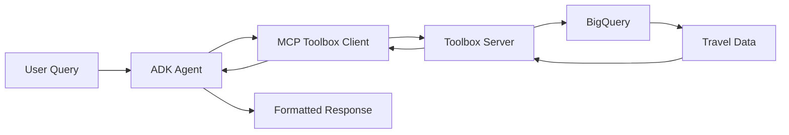

# 🚀 Quick Start: MCP Toolbox + BigQuery Integration

Get your ADK agent connected to BigQuery through MCP Toolbox in 5 steps!

## Prerequisites

- ✅ Google Cloud project with BigQuery API enabled
- ✅ Service account credentials configured
- ✅ `toolbox-core` installed: `pip install toolbox-core`

## Step 1: Set Up BigQuery Dataset

```bash
# Create BigQuery dataset and tables with sample data
python setup_bigquery_dataset.py
```

This creates:
- Dataset: `privacy-ml-lab2.travel_data`
- Tables: `destinations`, `user_preferences`, `agent_interactions`
- Sample travel destinations data

## Step 2: Start MCP Toolbox Server

```bash
# Start Toolbox server with our configuration
toolbox serve --config tools.yaml --port 5000
```

**Note**: To start the toolbox server with service account credentials, use this command:
```bash
GOOGLE_APPLICATION_CREDENTIALS=/Users/pskulkarni/Documents/source-code/privacy-ml-lab2-9eb2bfb2e71e.json toolbox --tools-file tools.yaml --port 5000 -a 127.0.0.1
```

The `tools.yaml` defines:
- **BigQuery Source**: Connected to your project with service account auth
- **Travel Tools**: 7 specialized tools for destination search, preferences, etc.
- **Query Templates**: Parameterized SQL for safe, flexible queries

## Step 3: Test the Integration

```bash
# Run comprehensive test suite
python test_mcp_toolbox_workflow.py
```

This tests:
- ✅ BigQuery permissions and connectivity
- ✅ MCP Toolbox server functionality  
- ✅ Tool loading and execution
- ✅ Complete query workflow

## Step 4: Start Your ADK Agent

```bash
# Start ADK web interface
adk web
```

Your agent now has access to these BigQuery-powered tools:
- `search-destinations` - Find destinations by budget, region, category, season
- `get-all-destinations` - Browse all available destinations
- `save-user-preferences` - Store user travel preferences
- `get-user-preferences` - Retrieve saved preferences
- `search-budget-destinations` - Budget-focused search
- `search-seasonal-destinations` - Season-focused search

## Step 5: Test with Natural Queries

Try these queries with your agent:

### 🏖️ **Budget Beach Destinations**
*"Find me affordable beach destinations in Southeast Asia"*

### 🏔️ **Luxury Mountain Resorts**  
*"I want luxury mountain destinations for winter skiing"*

### 🏛️ **Cultural City Experiences**
*"Show me cultural destinations in Europe for spring travel"*

### 💾 **Save Preferences**
*"I prefer mid-range accommodations and love hiking"*

## 🎯 How It Works



1. **User asks**: "Find budget beach destinations"
2. **ADK Agent**: Processes query, calls MCP Toolbox tools
3. **Toolbox**: Executes parameterized BigQuery queries
4. **BigQuery**: Returns travel data matching criteria
5. **Agent**: Formats results into natural language response

## 🔧 Available Tools

| Tool Name | Purpose | Parameters |
|-----------|---------|------------|
| `search-destinations` | Smart destination search | budget_category, region, category, season, limit |
| `get-all-destinations` | Browse destinations | limit |
| `save-user-preferences` | Store user preferences | user_id, preference_type, preference_value |
| `get-user-preferences` | Retrieve preferences | user_id |
| `search-budget-destinations` | Budget-focused search | budget_category, category, limit |
| `search-seasonal-destinations` | Season-focused search | season, limit |
| `log-interaction` | Track agent interactions | user_id, query_type, response, tools_used |

## 🔒 Security Features

- **Service Account Authentication**: Secure, token-based access to BigQuery
- **Parameterized Queries**: SQL injection protection built-in  
- **User Context Isolation**: Each user's data is properly scoped
- **Audit Logging**: All interactions tracked in `agent_interactions` table

## 🚀 Production Tips

### **Scaling Up**
- Add more destinations to BigQuery tables
- Create indexes on frequently queried columns
- Use BigQuery's partitioning for large datasets

### **Enhanced Features**
- Add user authentication with `useClientOAuth: true` in tools.yaml
- Create custom tools for booking integration
- Add caching with BigQuery materialized views

### **Monitoring**
- Monitor Toolbox server logs
- Track query performance in BigQuery console
- Use `agent_interactions` table for usage analytics

## 🎉 You're Ready!

Your ADK agent now has enterprise-grade database capabilities through MCP Toolbox. Users can:

- 🔍 **Search** millions of destinations with natural language
- 💾 **Remember** preferences across sessions
- 📊 **Analyze** travel patterns and popular destinations
- 🔒 **Scale** securely with proper authentication

Try asking your agent: *"Find me the perfect destination for a budget summer vacation with beach activities!"*